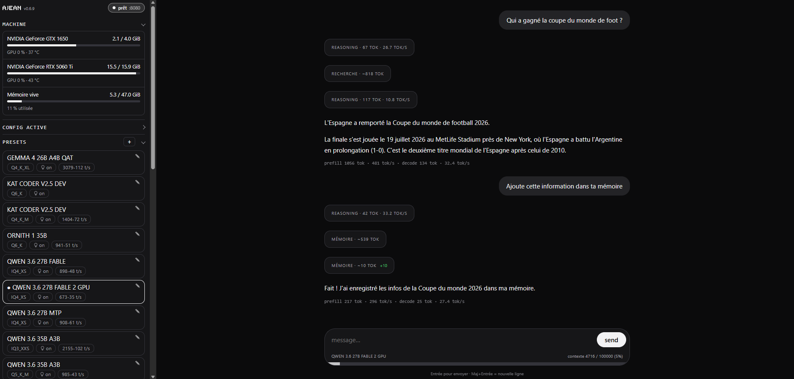

# AJEAN



**Une application complète pour faire tourner vos modèles d'IA en local, dans un seul binaire : chat, mémoire persistante, accès web, outils et accès à distance chiffré.**

AJEAN fournit tout ce qui entoure le modèle : l'interface de chat, les outils de l'assistant, la gestion du service et celle du matériel. Le moteur d'inférence est [llama.cpp](https://github.com/ggml-org/llama.cpp), qu'AJEAN compile lui-même pour la machine sur laquelle il tourne.

```
télécharger le binaire  →  jean llamacpp install  →  jean edit  →  jean start  →  c'est parti
```

Aucune dépendance à l'exécution, aucun flag CMake à retenir, aucun conteneur. Vous obtenez une interface de chat complète et un endpoint compatible OpenAI pour vos outils tiers.

---

## Ce que fait AJEAN

**Un assistant, pas seulement un modèle.** L'interface web offre un chat avec raisonnement affiché, mémoire persistante, compactage automatique du contexte quand la conversation s'allonge, prompt système éditable, et des réglages d'apparence synchronisés entre appareils.

**Des outils réels.** `jean agent on` active d'un seul coup toutes les capacités du modèle sur la machine :

| Outil | Rôle |
|---|---|
| terminal | exécute une commande (bash sous Unix, `cmd.exe` sous Windows) |
| write / edit | écrit un fichier, ou le modifie par remplacement exact |
| mem_* | mémoire Markdown persistante entre les sessions |
| web_* | recherche et lecture de pages, via Crawl4AI |
| mcp__* | les outils des serveurs MCP configurés |

**Le matériel et le moteur, gérés pour vous.** `jean llamacpp install` clone et compile llama.cpp avec les bons flags pour *cette* machine : CUDA (capacité de calcul détectée par GPU, donc le multi-GPU fonctionne), ROCm, Metal, Vulkan, ou repli CPU. `jean llamacpp update` récupère le dernier commit, arrête le service le temps de recompiler, puis le redémarre.

**Un service, pas un script.** `jean install` écrit l'unité systemd, la règle sudoers et les dossiers. Ensuite `start` / `stop` / `status` / `logs`. Windows et macOS ont leurs équivalents natifs (voir plus bas).

**Plusieurs modèles, un clic.** Les presets gardent chacun leur configuration complète ; basculer de l'un à l'autre recharge le modèle sans toucher à un fichier. Les `.gguf` peuvent vivre sur n'importe quel disque.

**Accessible de partout.** `jean link` ouvre une connexion sortante vers [ajean.link](https://ajean.link), donc aucun port à ouvrir, et cela fonctionne même en CGNAT. Le chat est chiffré de bout en bout : le relais ne voit jamais les conversations.

## Démarrage

### 1. Le binaire

```bash
curl -L -o jean https://github.com/nathaninline/jean/releases/latest/download/jean-linux-amd64
chmod +x jean
sudo mv jean /usr/local/bin/jean
```

(Autres cibles sur la page [Releases](../../releases) : Linux, macOS et Windows, en amd64 et arm64.)

### 2. Installation et compilation du moteur

```bash
sudo jean install        # unité systemd, sudoers, dossiers
jean llamacpp install    # compile llama.cpp pour le GPU présent
```

Nécessite `git` et `cmake`, plus le toolkit de l'accélérateur (CUDA, ROCm…) pour l'accélération GPU.

### 3. Démarrage

```bash
jean edit      # régler MODEL=/chemin/vers/le-modele.gguf
jean start
jean test      # vérifier que le modèle répond
jean web       # http://<hôte>:8090
```

## Commandes

```
Application :
  app                           lance l'UI web + ouvre le navigateur (auto au double-clic)
  web [PORT]                    UI web seule (défaut :8090)
  chat [prompt-système]         chat dans le terminal

Service :
  start | stop | restart        gérer le service
  status | logs                 état / logs en direct
  enable | disable              démarrage au boot
  edit                          éditer $JEAN_HOME/config.env
  test | bench [N]              vérifier que le modèle répond / mesurer les tok/s
  vram | gpu [index…]           VRAM / choix des GPU (gpu all = tous)
  set-api-key [clé]             protéger le moteur d'inférence (Bearer)
  set-web-key [clé]             protéger l'API de pilotage

Capacités de l'IA :
  agent [on|off|status]         active TOUS les outils (terminal, fichiers, mémoire)
  memory [off|ondemand|always]  mode mémoire
  internet [on|off|url <url>|key <clé>]   accès web via Crawl4AI

Presets et moteur :
  switch [N]                    changer de preset (configs/)
  llamacpp install|update|status

Accès distant (ajean.link) :
  link <token>                  enregistre le token et démarre le lien
  link start|restart|stop       gérer le service de lien
  link code                     code d'appairage (10 min, usage unique)
  link status|logout

Installation :
  install | uninstall
  update [--check]              mise à jour depuis les releases GitHub
  version
```

## Configuration

Tout vit sous **`$JEAN_HOME`** (`/etc/jean` sous Linux/macOS, `%ProgramData%\jean` sous Windows). Le service lit `config.env` :

| Clé | Signification | Défaut |
|-----|---------------|--------|
| `BIN` | chemin vers `llama-server` (réglé par `llamacpp install`) | — |
| `MODEL` | nom de fichier ou chemin complet du `.gguf` | — |
| `HOST` / `PORT` | adresse / port d'écoute | `0.0.0.0` / `8080` |
| `CTX` | taille du contexte | `32768` |
| `NGL` | couches déportées sur le GPU | `999` |
| `BATCH` / `UBATCH` | batch / micro-batch | `2048` / `512` |
| `THREADS` / `THREADS_BATCH` | threads CPU | `0` (auto) |
| `KV_TYPE` (`_K` / `_V`) | quantization du cache KV | — |
| `CUDA_VISIBLE_DEVICES` | GPU utilisés (réglé par `jean gpu`) | tous |
| `REASONING` | passthrough du mode raisonnement | — |
| `REASONING_BUDGET` | plafond de tokens de réflexion ; `-1` = illimité | `-1` |
| `COMPACT` | compactage automatique du contexte (`off` pour couper) | activé |
| `MEM_MODE` | mémoire : `off` / `ondemand` / `always` | `always` |
| `CRAWL4AI_URL` / `CRAWL4AI_KEY` | serveur d'accès internet | — |
| `EXTRA_ARGS` | ajouté tel quel à la ligne de commande du moteur | — |

La clé API (`jean set-api-key`) vit dans `$JEAN_HOME/.api_key`, à part, afin de survivre aux changements de preset.

**Modèles sur un autre disque.** Les `.gguf` n'ont pas à résider dans `$JEAN_HOME` : dans l'éditeur de preset de l'interface, section *Modèle → Dossiers de modèles*, ajoutez le dossier voulu. Ses modèles apparaissent dans la liste, groupés par dossier. La liste est enregistrée dans `model_dirs.json`, donc conservée d'un preset à l'autre.

### Variables d'environnement

| Variable | Rôle | Défaut |
|----------|------|--------|
| `JEAN_HOME` | racine des données | `/etc/jean`, `%ProgramData%\jean` |
| `JEAN_MODEL_DIRS` | dossiers de modèles (séparés par `:`, `;` sous Windows) | — |
| `JEAN_SERVICE` | nom de l'unité systemd | `jean` |
| `HF_TOKEN` | token Hugging Face pour les modèles privés | — |
| `JEAN_DL_CONNS` | connexions parallèles au téléchargement | — |
| `EDITOR` | éditeur pour `jean edit` | `nano` / `notepad` |

## Les capacités de l'IA

### Mémoire

L'IA tient des pages Markdown sous `$JEAN_HOME/MEMORY/`, relues et mises à jour entre les sessions. Trois modes, indépendants du mode agent :

```bash
jean memory always     # (défaut) elle cherche avant de répondre et enregistre d'elle-même
jean memory ondemand   # outils disponibles, mais utilisés seulement sur demande
jean memory off        # mémoire coupée
```

### Accès internet

Par défaut, l'IA n'a pas accès au web. En branchant un serveur [Crawl4AI](https://github.com/unclecode/crawl4ai), elle gagne `web_search` (DuckDuckGo), `web_open`, `web_read` et `web_grep`. **AJEAN ne fournit pas ce serveur, il s'y branche :**

```bash
docker run -d -p 11235:11235 --shm-size=1g unclecode/crawl4ai:latest
jean internet url http://localhost:11235
jean internet on
jean internet status
```

Les outils web ne sont proposés au modèle que si le mode agent est actif, l'accès internet activé **et** le serveur joignable. Sinon ils n'existent pas, et le modèle ne peut donc pas les inventer.

### Serveurs MCP

AJEAN parle le [Model Context Protocol](https://modelcontextprotocol.io) : on y branche des serveurs tiers (fichiers, bases de données, API…) et leurs outils s'ajoutent à ceux de l'IA, nommés `mcp__<serveur>__<outil>`.

La configuration se fait depuis l'interface web (section *Serveurs MCP*) ou en éditant `$JEAN_HOME/mcp.json`, au **même format que Claude Desktop**, si bien qu'un fichier existant se réutilise tel quel :

```json
{
  "mcpServers": {
    "fs": { "command": "npx", "args": ["-y", "@modelcontextprotocol/server-filesystem", "/data"] },
    "api": { "url": "https://exemple.com/mcp" }
  }
}
```

Les transports **stdio** et **HTTP** sont pris en charge. Comme le terminal, un serveur MCP exécute du code sur la machine hôte : ses outils ne sont donnés au modèle que si le mode agent est actif.

## Windows

- **Pas de systemd** : `jean start` lance le service en arrière-plan (suivi par fichier PID) ; `stop`, `restart`, `status` et `logs` agissent dessus, sans droits administrateur. `enable` / `disable` ne sont pas gérés, il faut passer par une tâche planifiée.
- `JEAN_HOME` vaut `%ProgramData%\jean` (repli `%LOCALAPPDATA%\jean`).
- `jean install` crée seulement le dossier de données et un `config.env` de départ.
- Le terminal de l'IA passe par `cmd.exe`. Elle le sait, et écrit ses fichiers par l'outil dédié plutôt que par le shell, ce qui lui permet de produire des scripts contenant des guillemets.

```powershell
jean install
jean edit          # BIN=...\llama-server.exe et MODEL=...\modele.gguf
jean start
jean status
```

`jean llamacpp install` compile également sous Windows si `git` et `cmake` sont présents ; sinon, récupérer un `llama-server.exe` pré-compilé et pointer `BIN` dessus.

## macOS

La page [Releases](../../releases) publie `Jean-macos-arm64.zip` / `Jean-macos-amd64.zip`, un bundle **`Jean.app`**. Dézipper, glisser dans *Applications*, ouvrir : l'interface démarre sur `http://localhost:8090`, s'ouvre dans le navigateur, et l'icône se pose dans la **barre de menus**. Pas de fenêtre de Terminal, pas d'icône dans le Dock.

L'application n'est signée qu'en ad-hoc : au premier lancement, faire **clic droit → Ouvrir**.

Pour un usage en ligne de commande, prendre le binaire nu `jean-darwin-arm64` : hors bundle, il conserve son comportement CLI. Les services passent par **launchd**.

## Accès distant via ajean.link

`jean link` ouvre une connexion **sortante** vers le relais : le serveur reste injoignable depuis l'extérieur, mais reste accessible de partout.

```bash
jean link <token>        # token fourni sur ajean.link
jean link code           # code d'appairage à saisir dans le portail
```

Le lien tourne comme un service : la commande rend la main, la connexion continue en tâche de fond. Inutile de lancer `jean web`, l'interface est servie dans le tunnel. Le portail donne accès à l'interface du serveur avec un chat chiffré, à la gestion de plusieurs machines, et en option à un endpoint compatible OpenAI.

Il s'agit d'un service optionnel et payant ; tout le reste d'AJEAN est et restera open source et gratuit.

### Sécurité : la boîte noire

Le relais est conçu comme un **tube aveugle** : il transporte les données sans pouvoir les lire.

- **Chat chiffré de bout en bout** (X25519 + AES-GCM). La clé est dérivée du mot de passe via **OPAQUE** et ne quitte jamais le navigateur.
- **Empreinte vérifiée.** `jean link` affiche l'empreinte de la clé de la machine, à confirmer une fois dans le portail, ce qui défait toute tentative d'interception par le relais.
- **Appairage authentifié.** Un code à usage unique (`jean link code`) garantit qu'un seul navigateur autorisé pilote le serveur ; même compromis, le relais ne peut pas forger de commande.
- **Code servi hors du relais.** Le portail provient d'une origine indépendante (GitHub Pages) : le relais ne peut pas injecter de code pour dérober la clé.

Reste visible du relais : des métadonnées techniques (machine en ligne, modèle chargé, VRAM), jamais le contenu des conversations.

### Endpoint OpenAI (opt-in)

Pour brancher des outils tiers, AJEAN peut exposer `https://<machine>.oai.ajean.link/v1`, authentifié par la clé API du serveur. **Désactivé par défaut**, activable par machine depuis l'interface (panneau *Accès OpenAI*), sans redémarrage.

Le VPS effectue un simple **passthrough SNI** : le TLS est terminé sur la machine hôte (Let's Encrypt via TLS-ALPN-01, à travers le tunnel), le relais ne voit que du chiffré.

## API de pilotage

`jean web` expose une API HTTP pour piloter AJEAN à distance. À protéger avant toute exposition :

```bash
jean set-web-key      # génère une clé
```

Chaque appel `/api/*` présente alors `Authorization: Bearer <clé>` :

| Méthode | Endpoint | Rôle |
|---------|----------|------|
| GET  | `/api/ping` | connectivité + validité de la clé |
| GET  | `/api/status` · `/api/vram` | état du service · GPU |
| GET  | `/api/presets` | liste des presets (avec l'actif) |
| POST | `/api/switch` `{"n":<index>}` | changer de modèle |
| POST | `/api/start` · `/api/stop` · `/api/restart` | piloter le service |
| POST | `/api/chat` `{"messages":[…]}` | chat (flux SSE) |

> ⚠️ La clé voyage en clair en HTTP. Pour une exposition publique, placer un reverse-proxy HTTPS devant, ou utiliser `jean link`.

## Compiler depuis les sources

Go 1.25+. AJEAN est écrit à 100 % en Go, l'interface est embarquée via `go:embed` :

```bash
git clone https://github.com/nathaninline/jean.git
cd jean
CGO_ENABLED=0 go build -o jean ./cmd/jean
```

> Compiler **AJEAN** ne demande que Go. Compiler le **moteur llama.cpp** demande `git`, `cmake` et le toolkit de l'accélérateur.

## Arborescence

- `cmd/jean/` : point d'entrée + ressources Windows (icône, versioninfo).
- `internal/jean/` : tout le code, fichiers préfixés par domaine (`web_*`, `chat_*`, `llm_*`, `backend_*`, `relay_*`, `sys_*`, `mcp_*`) ; carte dans `doc.go`.
- `internal/jean/ui/` : interface web embarquée. **`index.html` est généré** : les sources vivent dans `ui/src/`. Pour modifier l'interface, éditer `ui/src/` puis lancer `go generate ./internal/jean`.

## Licence

[MIT](LICENSE). Le `marked.min.js` embarqué est [Marked](https://github.com/markedjs/marked), également MIT.
